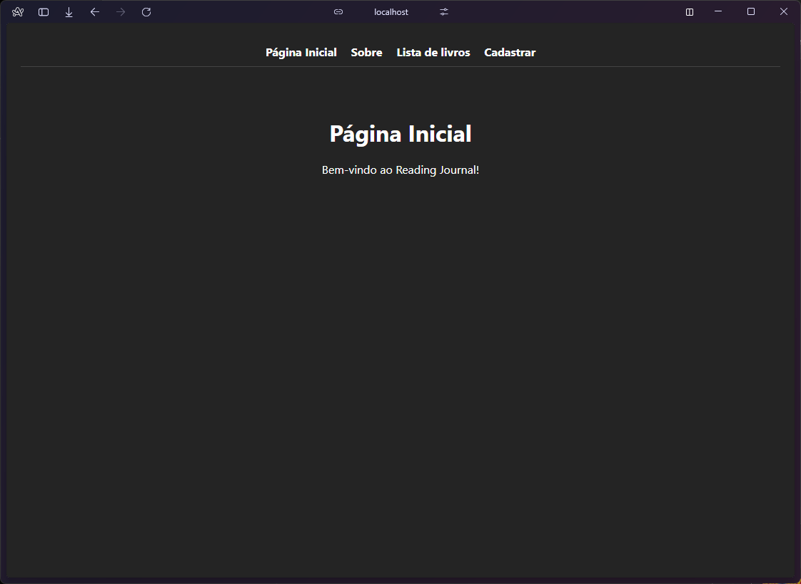
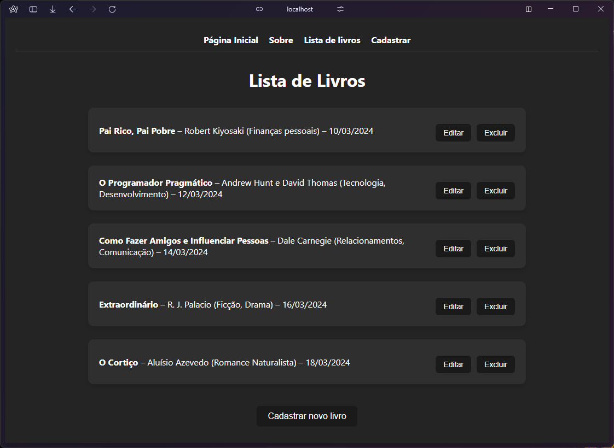
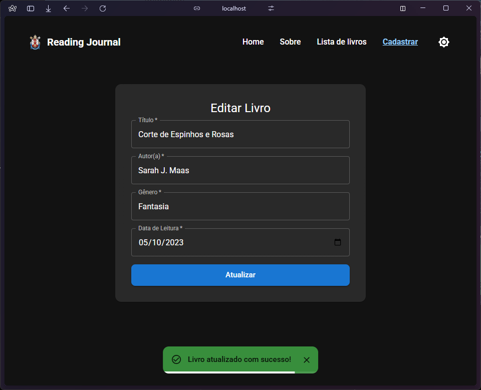
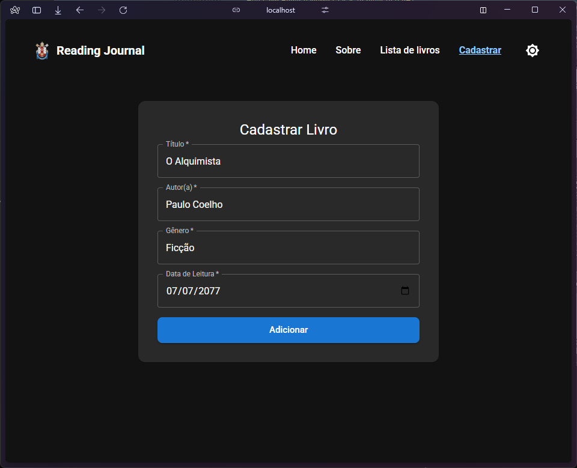
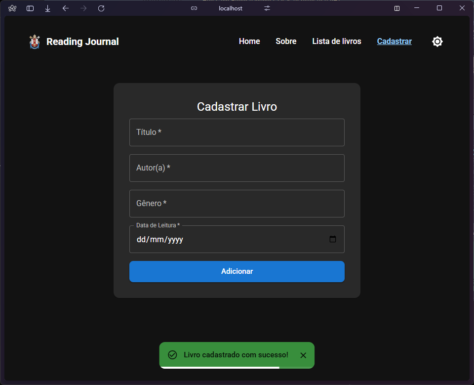

# Reading Journal 📚

Este é um projeto desenvolvido para a **Fase 2** da disciplina de **Desenvolvimento de Sistemas Frontend** do curso de Análise e Desenvolvimento de Sistemas da PUCRS.  
O objetivo foi criar um CRUD completo (Create, Read, Update, Delete) para um inventário de livros lidos, com integração a uma API REST fornecida pela instituição e interface moderna utilizando Material UI.

## 👤 Aluno

Carlos Eduardo B. Kessler  
Curso: Análise e Desenvolvimento de Sistemas – PUCRS Online

## 🔧 Tecnologias utilizadas

- React
- Vite
- Material UI (MUI)
- React Router DOM
- Axios
- JavaScript (ES6+)
- Vitest (testes funcionais)
- Modo Escuro/Claro com persistência local (tema dinâmico)
- Snackbar com barra de progresso
- Responsividade completa (NavBar adaptativa)

## 🚀 Como executar o projeto

1. Clone este repositório ou extraia o `.zip` enviado.
2. No terminal, navegue até a pasta do projeto e instale as dependências:

   ```bash
   npm install
   ```

3. Execute a API fornecida pela disciplina:

   - Clone o repositório da API:  
     [https://github.com/adsPucrsOnline/DesenvolvimentoFrontend](https://github.com/adsPucrsOnline/DesenvolvimentoFrontend)

   - Navegue até a pasta da API:

   ```bash
   cd ./DesenvolvimentoFrontend/readingJournal-api/
   ```

   - Instale as dependências da API:

   ```bash
   npm install
   ```

   - Inicie a API:

   ```bash
   npm start
   ```

   - A API estará disponível em:  
     <http://localhost:5000>

4. Volte para a pasta do projeto React e inicie o servidor de desenvolvimento:

   ```bash
   npm run dev
   ```

5. Acesse a aplicação no navegador:  
   <http://localhost:5173>

## 🧩 Funcionalidades implementadas

- **Listagem de livros (GET)**
  Exibe todos os livros cadastrados com busca dinâmica, botões de edição e exclusão.

- **Cadastro e Edição de livros (POST & PUT)**
  Formulário com validações, foco automático, preenchimento automático em modo de edição, e feedback visual com Snackbar.
  Após cadastrar ou editar, a lista rola suavemente até o livro em questão.

- **Exclusão de livro (DELETE)**
  Remove o livro da API com notificação de sucesso.
  Feedback é exibido com Snackbar e barra de progresso embutida.

- **Tema escuro/claro com botão de alternância**
  Preferência do usuário é armazenada no `localStorage`.

- **Barra de navegação responsiva com menu hambúrguer no mobile**

- **Página Sobre com contexto do projeto e Página Home introdutória**

- **Testes funcionais com Vitest e Testing Library**

## 🧪 Testes

Foram criados testes com `Vitest` e `@testing-library/react` para os principais componentes:

- `BookList` — renderização de livros e exclusão
- `BookForm` — validação e envio do formulário
- `NavBar` — visibilidade e navegação dos links

Para rodar os testes:

```bash
npm test
```

## 📦 Componentes principais

### `BookForm`

Formulário reutilizável com MUI para cadastro e edição.  
Possui validação dos campos, inputs controlados e integração com a API.  
Após o envio, redireciona para a listagem com feedback visual exibido via Snackbar.

### `BookList`

Renderiza dinamicamente os livros cadastrados.  
Inclui botões para editar e excluir.

### `BookListPage`

Página principal com campo de busca, listagem filtrada e botão para adicionar novo livro.

### `AddBook`

Página com formulário para cadastrar ou atualizar um livro.  
Exibe Snackbar animado com barra de progresso.

### `NavBar`

Barra de navegação responsiva, com links estilizados, menu hambúrguer e botão de alternância de tema.

## ✅ Observações

- Projeto utiliza somente Material UI para toda a interface.
- Modo escuro/claro com tema global via `ThemeProvider`.
- Snackbar com `LinearProgress` embutido.
- Utilização de hooks personalizados como `usePageTitle`.
- Código limpo, organizado por pastas e com tipagens adequadas.

## 🖼️ Prints da aplicação

### Página Inicial



### Página de Lista de Livros



### Página de Edição de Livro



### Página de Cadastro




