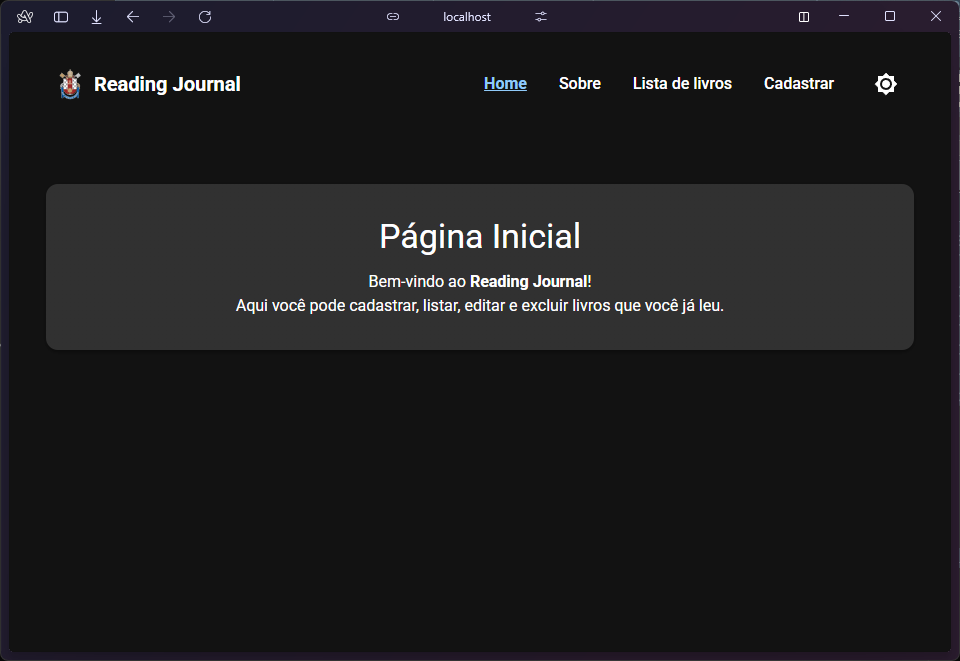

# Reading Journal 📚

Este é um projeto da **Fase 1** da disciplina de **Desenvolvimento de Sistemas Frontend** do curso de Análise e Desenvolvimento de Sistemas da PUCRS.  
O objetivo foi desenvolver um CRUD (Create, Read, Update, Delete) para um inventário de livros lidos — um "Reading Journal", utilizando React e Vite.

## 👤 Aluno

Carlos Eduardo B. Kessler  
Curso: Análise e Desenvolvimento de Sistemas – PUCRS Online

## 🔧 Tecnologias utilizadas

- React
- Vite
- React Router DOM
- JavaScript (ES6+)
- CSS com tema escuro/claro adaptado ao sistema

## 🚀 Como executar o projeto

1. Extraia o arquivo `.zip` fornecido
2. No terminal, navegue até a pasta do projeto
3. Instale as dependências:

   ```bash
   npm install
   ```

4. Inicie o servidor de desenvolvimento:

   ```bash
   npm run dev
   ```

5. Acesse no navegador:  
   [http://localhost:5173](http://localhost:5173)

## 📌 Componentes principais

### 📄 BookForm

Componente responsável pelo formulário de cadastro e edição de livros.  
Contém validação de campos, feedback visual de erro/sucesso e permite adicionar ou atualizar os dados de forma dinâmica.

### 📄 BookList

Exibe todos os livros cadastrados em uma lista.  
Cada item possui botões para **editar** (que leva ao formulário com os dados preenchidos) e **excluir** (remove o item da lista).

### 📄 NavBar

Componente fixo de navegação entre as páginas da aplicação:

- Página inicial
- Cadastro de livros
- Lista de livros
- Sobre

## ✅ Observações

- Os dados são manipulados estaticamente via estado local, conforme solicitado para a Fase 1.
- Não há integração com banco de dados ou API externa.
- A aplicação está adaptada para modo escuro/claro de acordo com o sistema do usuário.
- Datas exibidas no formato brasileiro (DD/MM/YYYY) com função reutilizável.

## 🖼️ Prints da aplicação

📌 Página inicial e navegação:  


📌 Página de cadastro de livro:  


📌 Página com lista de livros:  

